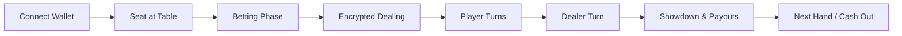

# ♠️ CipherJack – Encrypted Blackjack on Zama fhEVM

CipherJack is a full multiplayer blackjack dApp on **Sepolia** where live card hands are stored as encrypted `euint8` handles on-chain. Players decrypt their own cards via the Zama relayer SDK; a signed **game oracle** shuffles, deals, and settles hands off-chain.

**Live demo:** [https://cipherjack.xyz](https://cipherjack.xyz)  
**Contract (Sepolia):** [`0x43d1B6dAD0194D28fD37f9310495BBf07f55F67B`](https://sepolia.etherscan.io/address/0x43d1B6dAD0194D28fD37f9310495BBf07f55F67B)  
**Repository:** [https://github.com/amar71094/blackjack-fhevm](https://github.com/amar71094/blackjack-fhevm)

> Sepolia testnet only — play chips, not real money. Promo chips cannot be withdrawn.

## 📚 Contents

1. [Highlights](#-highlights)
2. [Gameplay](#-gameplay)
3. [Privacy Model](#-privacy-model)
4. [Architecture](#-architecture)
5. [Repository Layout](#-repository-layout)
6. [Prerequisites](#-prerequisites)
7. [Quick Start](#-quick-start)
8. [Frontend](#-frontend)
9. [Backend & Oracle](#-backend--oracle)
10. [Zama FHE Flow](#-zama-fhe-flow)
11. [Testing](#-testing)
12. [Deployment](#-deployment)
13. [Security Notes](#-security-notes)
14. [Contributing](#-contributing)

## ✨ Highlights

- **FHE-backed live play** — card ranks and suits are encrypted handles on-chain; only your wallet decrypts your hand during play.
- **Wallet-first UX** — MetaMask + WalletConnect, lobby, table browser, chip buy/withdraw, and responsive game UI.
- **Signed game oracle** — watches `OracleActionRequired`, deals with FHE encrypted inputs, and settles hands; only `gameOracle` may fulfill oracle actions.
- **On-chain chip economy** — free promo chips, ETH purchases, withdrawals (ETH-purchased chips only), dealer-bank float, and automatic payouts.
- **Multiplayer tables** — up to 4 players per table, 60-second turn timer (oracle auto-stands on timeout).
- **Table activity history** — oracle serves the last 100 hands per table via HTTP API.
- **Integration tests** — `@fhevm/hardhat-plugin` mock encryption for full oracle flows on Hardhat.

**Stack:** `@fhevm/solidity` 0.11.1 · `@zama-fhe/relayer-sdk` 0.4.x · React · wagmi · Hardhat

## 🎮 Gameplay

| Setting | Value |
| --- | --- |
| Network | Sepolia testnet |
| Free promo chips | 2,000 per wallet (one-time claim) |
| Players per table | Up to 4 |
| Turn timer | 60 seconds (auto-stand via oracle) |
| Dealer rules | Hits on ≤16, stands on ≥17 (incl. soft 17) |
| Payouts | Win 1:1 · Blackjack 3:2 · Push returns bet |

**Typical flow:** Connect wallet → claim chips → join or create a table → bet → decrypt your encrypted hand → Hit / Stand / Double → showdown (dealer reveal) → next hand or cash out.

Routes: `/` (lobby) · `/game/:tableId` (live table + spectator view)

## 🔐 Privacy Model

| Layer | Private today | Still public |
| --- | --- | --- |
| Live contract storage | Encrypted handles + `cardCount` | Bets, chips, phase, deck commitment hash |
| Player UI | Your cards (FHE user-decrypt) | — |
| Showdown | — | Dealer cards (public decrypt), outcomes, payouts |
| Oracle transactions | Ciphertext handles + ZK `inputProof` | Settlement totals, bust flags |
| Deck order | Oracle-side only | `deckCommitment` hash on-chain |

**Encrypted-input dealing:** the oracle uses `createEncryptedInput` + `FHE.fromExternal` — card ranks/suits never appear as plaintext in live transaction calldata.

## 🏗 Architecture



- **UI (React + wagmi):** wallet connect, lobby reads, FHE user-decrypt for player cards, public decrypt at showdown.
- **Contract (Solidity):** chip custody, table state, encrypted handle storage, ACL grants, oracle-gated deal/settle.
- **Oracle (Node.js):** event-driven worker for `OracleActionRequired`, FHE encrypted dealing, turn timeout enforcement, hand-history API.

See [DEPLOY.md](./DEPLOY.md) for the full Sepolia deployment and smoke-test checklist.

## 🗂️ Repository Layout

```
blackjack-fhevm/
├── backend/                         # Hardhat contracts + game oracle
│   ├── contracts/
│   │   ├── Blackjack.sol            # Main contract entry
│   │   ├── BlackjackGameplay.sol    # Hand flow + oracle hooks
│   │   ├── BlackjackEconomy.sol     # Chips, buy/withdraw, free grant
│   │   ├── BlackjackOracle.sol      # Oracle fulfillment
│   │   ├── BlackjackTableMgmt.sol   # Create/join/leave tables
│   │   ├── BlackjackViews.sol       # Lightweight lobby reads
│   │   └── libraries/BlackjackMathLib.sol
│   ├── oracle/                      # Event watcher + blackjack engine + activity API
│   ├── test/Blackjack.test.js       # Unit + oracle integration tests
│   ├── deployments/sepolia.json     # Latest Sepolia deployment record
│   └── package.json
├── frontend/                        # Vite + React + Tailwind
│   ├── src/                         # Pages, hooks, components
│   ├── vercel.json                  # COOP/COEP headers for FHE WASM
│   └── README.md                    # Frontend-specific notes
├── DEPLOY.md                        # Submission / demo deployment runbook
└── README.md
```

## 🧰 Prerequisites

- Node.js 18+
- npm 9+ (or pnpm for backend — see `backend/.npmrc`)
- Git
- Sepolia test ETH for chip purchases (free promo chips available without ETH)

## ⚡ Quick Start

**Play the live deployment** (oracle must be running on the host configured in `VITE_ORACLE_ACTIVITY_URL`):

1. Open [https://cipherjack.xyz](https://cipherjack.xyz)
2. Connect wallet on **Sepolia**
3. Claim 2,000 free promo chips
4. Join a table and play

**Run locally** — follow [DEPLOY.md](./DEPLOY.md): deploy contract → sync ABI → configure `.env` → start oracle → start frontend.

## ⚛️ Frontend

```bash
cd frontend
npm install
npm run dev        # http://localhost:8080 (COOP/COEP enabled)
npm run build      # production bundle
npm run preview    # preview prod build
npm run lint       # ESLint
```

Copy `frontend/.env.example` → `frontend/.env`:

| Variable | Description |
| --- | --- |
| `VITE_BLACKJACK_CONTRACT` | Deployed Blackjack contract address |
| `VITE_FHE_TARGET_CHAIN_ID` / `VITE_FHE_GATEWAY_CHAIN_ID` | FHEVM target (11155111) & gateway (10901) chain IDs |
| `VITE_FHE_RELAYER_URL` / `VITE_FHE_RPC_URL` | Zama relayer + RPC for encrypted ops |
| `VITE_FHE_ACL_ADDRESS` | `0xf0Ffdc93b7E186bC2f8CB3dAA75D86d1930A433D` |
| `VITE_FHE_KMS_ADDRESS` | `0xbE0E383937d564D7FF0BC3b46c51f0bF8d5C311A` |
| `VITE_FHE_INPUT_VERIFIER_ADDRESS` | `0xBBC1fFCdc7C316aAAd72E807D9b0272BE8F84DA0` |
| `VITE_FHE_DECRYPTION_ORACLE_ADDRESS` | `0x5D8BD78e2ea6bbE41f26dFe9fdaEAa349e077478` |
| `VITE_FHE_INPUT_VERIFICATION_ADDRESS` | `0x483b9dE06E4E4C7D35CCf5837A1668487406D955` |
| `VITE_SEPOLIA_RPC_URL` | Sepolia RPC for wagmi reads |
| `VITE_WALLETCONNECT_PROJECT_ID` | WalletConnect Cloud project ID |
| `VITE_APP_PUBLIC_URL` / `VITE_APP_ICON_URL` | Wagmi / WalletConnect metadata |
| `VITE_ORACLE_ACTIVITY_URL` | Oracle hand-history API (e.g. `http://127.0.0.1:4001`) |

Relayer URL for Sepolia testnet: `https://relayer.testnet.zama.org`

See [frontend/README.md](./frontend/README.md) for UI routes, gameplay tips, and troubleshooting.

## ⚙️ Backend & Oracle

```bash
cd backend
npm install --legacy-peer-deps   # or: pnpm install
npm run compile
npm run test
npm run sync-abi               # refresh frontend/src/lib/blackjackAbi.ts
npm run deploy:sepolia
```

Copy `backend/.env.example` → `backend/.env`. Set `BANK_FUND_ETH` so `getBankHealth().solvent` is true after deploy.

**Game oracle (required for live play):**

```bash
cd backend
# BLACKJACK_CONTRACT_ADDRESS + ORACLE_PRIVATE_KEY must match on-chain gameOracle()
npm run oracle
```

The oracle watches `OracleActionRequired`, fulfills deal/hit/stand/settle actions, auto-advances timed-out turns (`forceAdvanceOnTimeout` after 60s), and serves table activity at `http://127.0.0.1:4001/tables/:id/activity`.

Key backend notes:

- Hardhat dual compilers (0.8.24 + 0.8.20) with `viaIR`
- `@fhevm/hardhat-plugin` 0.4.2 + `@fhevm/solidity` 0.11.1
- Tests: chip economy, oracle deal/stand/settle, encrypted-only live state, bank health, pause, mid-hand forfeit, `MAX_TABLES`
- Run **one** oracle instance (lock file: `oracle/.oracle.lock`)

## 🔐 Zama FHE Flow

**Encrypted relayer inputs** — oracle encrypts card values client-side; contract verifies ZK proofs and stores handles.

```solidity
// backend/contracts/Blackjack.sol
function _pushEncryptedCardFromExternal(
    uint tableId,
    address playerAddr,
    bytes32 encRankHandle,
    bytes32 encSuitHandle,
    bytes calldata inputProof
) private {
    euint8 encRank = FHE.fromExternal(externalEuint8.wrap(encRankHandle), inputProof);
    euint8 encSuit = FHE.fromExternal(externalEuint8.wrap(encSuitHandle), inputProof);
    FHE.allow(encRank, playerAddr);
    // ACL: player, contract, gameOracle
    ...
}
```

**Player decrypt (browser)** — `useBlackjackGame` loads or creates a wallet-signed decryption key, then calls `fhe.userDecrypt` on rank/suit handles.

**Oracle encrypt** (`backend/oracle/fheEncrypt.js`):

```javascript
const input = instance.createEncryptedInput(contractAddress, oracleAddress);
for (const rank of ranks) input.add8(rank);
for (const suit of suits) input.add8(suit);
const { handles, inputProof } = await input.encrypt();
```

**Showdown** — dealer cards use `makePubliclyDecryptable` + `fhe.publicDecrypt` after player turns complete.

## 🧪 Testing

```bash
cd backend && npm run test
cd frontend && npm run lint && npm run build
```

Coverage in `backend/test/Blackjack.test.js` includes:

- Chip minting, claiming, buy/withdraw math
- Table create/join/leave and auto game-start triggers
- Owner bank funding/defunding safeguards
- Seated-player top-ups, cash-outs, wallet restrictions
- Admin: pause/unpause, owner transfer, `MAX_TABLES` caps
- Oracle deal → stand → settle integration flow

## 🚀 Deployment

1. **Contracts:** `cd backend && npm run deploy:sepolia` → writes `deployments/sepolia.json`
2. **ABI sync:** `npm run sync-abi` → set `VITE_BLACKJACK_CONTRACT` in `frontend/.env`
3. **Oracle:** `npm run oracle` with matching `ORACLE_PRIVATE_KEY`
4. **Frontend:** `npm run build` → deploy `dist/` with COOP/COEP headers (`frontend/vercel.json`)

Full checklist: [DEPLOY.md](./DEPLOY.md)

## 🔐 Security Notes

- **Never commit** `frontend/.env`, `backend/.env`, or oracle session files (`oracle/.sessions.json`, `oracle/.commitment-seeds.json`, `oracle/.hand-history.json`)
- FHE decryption signatures are stored in **sessionStorage** (1-day TTL), cleared on wallet disconnect
- Monitor `getBankHealth()` — UI warns when the dealer bank float exceeds ETH backing
- `pause()` blocks all gameplay mutations
- Mid-hand `leaveTable` forfeits bets to `bankChips`

## 🤝 Contributing

1. Fork and clone the repo
2. Note whether your change touches `frontend/`, `backend/`, or both
3. Run `npm run lint` (frontend) and `npm run test` (backend)
4. Open a PR describing user-facing impacts and any new env/config requirements

Questions or bugs? [Open an issue](https://github.com/amar71094/blackjack-fhevm/issues).