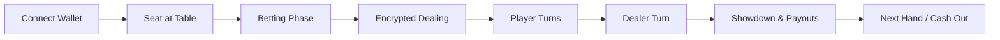

# ♠️ CipherJack – Encrypted Blackjack DApp Suite

CipherJack blends a cinematic blackjack experience with Zama's FHEVM. **v2** stores only encrypted `euint8` handles on-chain during live play; a dedicated **game oracle** (signed relayer service) shuffles, deals, and settles hands off-chain. This repo tracks the React frontend, Hardhat contracts, and oracle worker.

## 📚 Contents
1. [Highlights](#-highlights)
2. [Repository Layout](#%EF%B8%8F-repository-layout)
3. [Gameplay & Flow](#-gameplay--system-flow)
4. [Frontend Setup](#%EF%B8%8F-frontend-ui)
5. [Backend Setup & Tests](#%EF%B8%8F-backend-contracts--tests)
6. [Zama FHE Flow (Code Highlights)](#-zama-fhe-flow-code-highlights)
7. [Quality & Testing Checklist](#-quality--testing-checklist)
8. [Deployment Tips](#-deployment-tips)
9. [Security Notes](#-security--operational-notes)
10. [Contributing](#-contributing)

## ✨ Highlights
- **Wallet-first UX** with multi-player lobbies, rich chip interactions, and responsive layouts.
- **Zama FHE user-decrypt** – live hands store encrypted rank/suit handles only; players decrypt via `@zama-fhe/relayer-sdk` 0.4.x (`SepoliaConfig`).
- **Signed game oracle** – off-chain engine fulfills `OracleActionRequired`; only `gameOracle` may deal, hit, or settle.
- **Deterministic payouts** handled entirely in Solidity with configurable table stakes and dealer-bank management.
- **Lightweight lobby reads** via `getAllTableSummaries()` (no full deck/card payloads).
- **Integration tests** with `@fhevm/hardhat-plugin` mock encryption for full hand flows on Hardhat.

## 🗂️ Repository Layout
```
blackjack-fhevm/
├── backend/                    # Hardhat project for the Blackjack contract
│   ├── contracts/
│   │   ├── Blackjack.sol       # Core game logic + chip economy
│   │   └── (inherits ZamaEthereumConfig)   # On-chain wiring to FHEVM hosts
│   ├── oracle/                 # Event watcher + off-chain blackjack engine
│   ├── test/
│   │   └── Blackjack.test.js   # Unit + oracle-flow integration tests
│   ├── hardhat.config.js       # Multi-compiler setup with viaIR enabled
│   └── package.json            # Hardhat + @fhevm/solidity dependencies
├── frontend/                   # Vite + React + Tailwind application
│   ├── src/                    # Pages, hooks, components, and blackjack logic
│   ├── public/                 # Static assets
│   ├── package.json            # Frontend dependencies and scripts
│   └── README.md               # UI-specific instructions (legacy doc)
└── README.md                   # You are here – high level overview
```

## 🔄 Gameplay & System Flow

- **Encrypted handles:** every dealt card is stored as `euint8` rank/suit with ACLs; UI reads `getTablePlayState` (counts only) plus handle views for decrypt.
- **Oracle loop:** bets queue `DealHand` → oracle deals → player intents queue `Hit`/`Stand`/… → oracle fulfills → dealer play → `Settle` → `oracleSettleWithOutcomes`.
- **Chip custody:** ETH ↔ chip conversions happen through the contract, enabling free faucets, direct purchases, withdrawals, and a dealer-bank float (`fundBank` + `getBankHealth()`).
- **Table orchestration:** tables automatically advance from waiting → betting → turns → settlement; the lobby uses summary views instead of `getAllTables()`.

## 🔐 Privacy Model (v2 — honest scope)

| Layer | What is private today | What is still public |
| --- | --- | --- |
| Live contract storage | Only encrypted handles + `cardCount` | Bets, chips, phase, deck commitment hash |
| Player UI | Your cards via FHE user-decrypt | — |
| Showdown | Dealer cards via `makePubliclyDecryptable` + user decrypt | Outcome totals, payouts |
| Oracle transactions | Ciphertext handles + ZK `inputProof` only | Settlement totals/outcomes, bust flags |
| Deck order | Stays oracle-private (only `deckCommitment` hash on-chain) | Commitment hash is public |

**Encrypted-input dealing:** oracle uses `createEncryptedInput` + `FHE.fromExternal` — card ranks/suits never appear as plaintext in transaction calldata.

**Submission positioning:** CipherJack demonstrates production-oriented FHE integration (ACL, user/public decrypt, oracle-gated state) on a complete blackjack product aligned with `@fhevm/solidity` 0.11.1 and `@zama-fhe/relayer-sdk` 0.4.4.

## 🧰 Prerequisites
- Node.js 18+
- npm 9+
- Git + a Sepolia wallet for on-chain testing
- (Optional) Bun if you prefer the existing `bun.lockb` inside `frontend/`

## ⚛️ Frontend (UI)
```bash
cd frontend
npm install
npm run dev        # start Vite on http://localhost:5173
npm run build      # production bundle
npm run preview    # preview prod build
npm run lint       # ESLint health check
```
Copy `frontend/.env.example` to `frontend/.env` (never commit `.env`):

The UI expects the following environment variables:

| Variable | Description |
| --- | --- |
| `VITE_BLACKJACK_CONTRACT` | Deployed Blackjack contract address |
| `VITE_FHE_TARGET_CHAIN_ID` / `VITE_FHE_GATEWAY_CHAIN_ID` | FHEVM target & gateway chain IDs |
| `VITE_FHE_RELAYER_URL` / `VITE_FHE_RPC_URL` | Relayer + RPC endpoints for encrypted ops |
| `VITE_FHE_ACL_ADDRESS`, `VITE_FHE_KMS_ADDRESS`, `VITE_FHE_INPUT_VERIFIER_ADDRESS`, `VITE_FHE_INPUT_VERIFICATION_ADDRESS`, `VITE_FHE_DECRYPTION_ORACLE_ADDRESS` | Addresses supplied by the Zama coprocessor deployment |

> Sepolia + FHEVM v0.9 currently use `RELAYER_URL=https://relayer.testnet.zama.org`, `GATEWAY_CHAIN_ID=10901`, `ACL=0xf0Ffdc93b7E186bC2f8CB3dAA75D86d1930A433D`, `KMS=0xbE0E383937d564D7FF0BC3b46c51f0bF8d5C311A`, `INPUT_VERIFIER=0xBBC1fFCdc7C316aAAd72E807D9b0272BE8F84DA0`, `DECRYPTION_ORACLE=0x5D8BD78e2ea6bbE41f26dFe9fdaEAa349e077478`, and `INPUT_VERIFICATION=0x483b9dE06E4E4C7D35CCf5837A1668487406D955`.
| `VITE_APP_PUBLIC_URL` / `VITE_APP_ICON_URL` | Metadata used by Wagmi connectors |
| `VITE_SEPOLIA_RPC_URL` | Public RPC for wagmi’s chain config |
| `VITE_WALLETCONNECT_PROJECT_ID` | WalletConnect Cloud project identifier |

Refer to `frontend/README.md` for UI-specific copy, gameplay tips, and troubleshooting.

## ⚙️ Backend (Contracts & Tests)
```bash
cd backend
npm install --legacy-peer-deps
npm run compile
npm run test
npm run sync-abi     # refresh frontend/src/lib/blackjackAbi.ts
npm run deploy:sepolia
```
Key notes:
- `Hardhat` uses dual compilers (0.8.24 + 0.8.20) plus `viaIR`.
- `@fhevm/hardhat-plugin` 0.4.2 + `@fhevm/solidity` 0.11.1 for mock FHE in tests.
- Tests cover chip economy, oracle deal/stand/settle flow, encrypted-only live state, bank health, pause, mid-hand forfeit, and `MAX_TABLES`.
- Copy `backend/.env.example` → `backend/.env` for Sepolia deploy (`BANK_FUND_ETH` auto-funds the dealer bank).

### Game oracle (required for live play)
```bash
cd backend
# Set BLACKJACK_CONTRACT_ADDRESS + ORACLE_PRIVATE_KEY (must equal on-chain gameOracle)
npm run oracle
```
After deploy, call `setGameOracle(oracleSigner)` if the oracle key differs from the owner. The worker watches `OracleActionRequired` and submits signed fulfillment transactions.

## 🔐 Zama FHE Flow (Code Highlights)
**Encrypted relayer inputs** – oracle encrypts card values client-side; the contract verifies ZK proofs and stores handles.

```solidity
// backend/contracts/Blackjack.sol
function _pushEncryptedCardFromExternal(
    uint tableId,
    address playerAddr,
    bytes32 encRankHandle,
    bytes32 encSuitHandle,
    bytes calldata inputProof
) private {
    euint8 encRank = FHE.fromExternal(externalEuint8.wrap(encRankHandle), inputProof);
    euint8 encSuit = FHE.fromExternal(externalEuint8.wrap(encSuitHandle), inputProof);
    // ACL: player, contract, gameOracle
    FHE.allow(encRank, playerAddr);
    ...
}
```

**Off-chain handle decryption** – the React hook requests user approval, pulls encrypted handles, and feeds them through Zama's relayer SDK before updating the UI.

```ts
// frontend/src/hooks/useBlackjackGame.ts
const fhe = await ensureFhevmInstance();

const signingContext = await (async () => {
  try {
    const browserProvider = await getBrowserProvider();
    return { browserProvider };
  } catch (error) {
    if (walletClient) {
      return { walletClient };
    }
    return null;
  }
})();

const signature = await loadOrCreateSignature(
  fhe,
  contractAddress as `0x${string}`,
  signingContext
);

const queries = [...rankHandles, ...suitHandles].map((handle) => ({
  handle: hexlifyHandle(handle),
  contractAddress: contractAddress as `0x${string}`
}));

const decrypted = await fhe.userDecrypt(
  queries,
  signature.privateKey,
  signature.publicKey,
  signature.signature,
  signature.contractAddresses,
  signature.userAddress,
  signature.startTimestamp,
  signature.durationDays
);

const ranks = rankHandles.map((handle) => Number(decrypted[hexlifyHandle(handle)]));
const suits = suitHandles.map((handle) => Number(decrypted[hexlifyHandle(handle)]));
```

Oracle encryption (`backend/oracle/fheEncrypt.js`):

```javascript
const input = instance.createEncryptedInput(contractAddress, oracleAddress);
for (const rank of ranks) input.add8(rank);
for (const suit of suits) input.add8(suit);
const { handles, inputProof } = await input.encrypt();
```

Players decrypt their cards in the browser via `fhe.userDecrypt`; dealer cards use `fhe.publicDecrypt` after showdown.

## 🧪 Quality & Testing Checklist
- `backend`: `npm run test` – deploys to Hardhat Network and executes unit tests.
- `frontend`: `npm run lint` and `npm run build` – ensure TypeScript + Vite output is healthy before deploying.
- Coverage summary (see `backend/test/Blackjack.test.js`):
  - Chip minting, claiming, and withdrawal math.
  - Table creation/join/leave flows and auto game start triggers.
  - Owner-only bank funding/defunding safeguards.
  - Seated-player chip top-ups, cash-outs, and wallet restrictions.
  - Admin controls: pause/unpause, owner transfer, MAX_TABLES caps.
- Optional: wire anvil or Sepolia endpoints plus the relayer to run full integration sessions with the UI.

## 🚀 Deployment Tips
1. **Contracts:** `cd backend && npm run deploy:sepolia` (funds bank via `BANK_FUND_ETH`, writes `deployments/sepolia.json`).
2. **ABI sync:** `npm run sync-abi` then set `VITE_BLACKJACK_CONTRACT` in `frontend/.env`.
3. **Relayer:** use the Sepolia FHE addresses documented above in `frontend/.env`.
4. **Frontend:** `npm run build` and deploy `dist/` — `frontend/vercel.json` sets COOP/COEP headers required for FHE WASM.

## 🔐 Security & Operational Notes
- **Never commit** `frontend/.env` or `backend/.env` — use the `.env.example` templates.
- FHE decryption keys are kept in **sessionStorage** (1-day TTL), not `localStorage`.
- Monitor `getBankHealth()` — the UI warns when the bank float exceeds ETH backing.
- `pause()` now blocks all gameplay mutations, not just economy functions.
- Mid-hand `leaveTable` forfeits bets to `bankChips` and advances the hand when no players remain to act.

## 🤝 Contributing
1. Fork & clone the repo.
2. Decide whether the change touches `frontend/`, `backend/`, or both.
3. Run the relevant test suites (`npm run lint`, `npm run test`).
4. Open a PR summarizing user-facing impacts and any new env/config requirements.

Have questions? Feel free to open an issue describing the table flow, contract upgrade, or relayer challenge you are investigating.


lets now Add integration-style tests that walk through a full betting round -  what's local FHE precompiles

Add integration-style tests that walk through a full betting round once the local FHE precompiles are available.


I read the guides you linked (conditions, loops, relayer SDK) and, unfortunately, they confirm the earlier conclusion: Zama’s current Solidity tooling lets you store encrypted values, compare them, and emit handles for user-decrypt — but you still can’t branch the contract on ciphertext. Their own docs highlight these limits:

Conditions / branching: comparisons like FHE.lt(eq) return encrypted booleans (ebool). You can re-encrypt decrypted values, but you can’t use an encrypted boolean directly inside an if/else or loop to decide payouts. The docs explicitly show that you must decrypt (via relayer) before acting on the result. (See “Logics / Conditions”: it stops at producing encrypted flags and hands them to an oracle/relayer for decrypt before continuing execution.)

Loops: similar story — you can’t iterate until an encrypted condition is met; you’d have to decrypt each step or run the loop in plaintext. The blackjack contract’s payout logic depends heavily on branching and loops over hands, so it can’t remain private in pure Solidity without decrypting.

Relayer SDK: Zama’s relayer handles two things out of the box: authorizing decrypt requests (ACL) and performing decrypt operations (user decrypt or public decrypt). It doesn’t run complex blackjack logic for you. If you want privacy-preserving evaluation (e.g., sum cards under FHE, determine bust/stand privately), that logic must live in a service you control that uses the relayer SDK to manage keys and decrypts. Zama doesn’t provide a “blackjack oracle” — they give the primitives to build one.

So yes, Zama provides the building blocks (encrypted storage, ACL, decrypt APIs), but not a turnkey blackjack engine. To keep cards private:

Relayer service (custom) handles shuffling, FHE arithmetic, and decrypt decisions. It can use Zama’s relayer SDK to expose APIs, but you still write those endpoints yourself.
Smart contract stores encrypted handles/commitments, checks proofs/signatures from the relayer, and pays out accordingly.
Frontend talks to the relayer SDK endpoints to decrypt the local player’s cards and to fetch public decrypts when allowed.
Without that off-chain layer, the contract must decrypt values (or store them plaintext) to handle branching, which nullifies privacy. So building those APIs (or a relayer “microservice”) isn’t reinventing the wheel — it’s how Zama expects complex applications to be assembled.

If you want, I can sketch the relayer API surface using their SDK (e.g., /shuffle, /evaluate, /decrypt) along with the contract changes needed to consume it.

ok then if you are sure then explain the flow to me between UI, contract, zama's fhe and our custom service.


Here’s the end-to-end flow when you combine the smart contract, your custom relayer service, the Zama FHE tooling, and the UI. I’ll walk through the lifecycle of a hand so you can see where each piece fits.

1. Deck Creation & Publishing

Relayer service
Uses secure RNG to shuffle the deck and encrypt each card (rank, suit) into euint8 handles via Zama’s SDK.
Produces a deck commitment hash (to prevent tampering).
Calls the smart contract publishDeck(commHash, handleRanks[], handleSuits[]).
Smart contract
Records the commitment + arrays of ciphertext handles (no plaintext ranks stored).
Emits an event so the UI knows a new deck is ready.
2. Player Join & Buy-in

UI calls contract joinTable(buyIn); contract debits chips and adds a player entry with empty handle arrays (no cards yet).
3. Dealing Cards

When dealCardToPlayer/hit runs:
Smart contract increments deckIndex, pulls the ciphertext handles at that position, pushes them to the player’s encrypted arrays, and emits only the handles or a commitment.
It also calls FHE.allow(handle, player) and FHE.allow(handle, relayer) so both parties can decrypt.
No plaintext ever appears on-chain.
4. Player Hand Reveal (Private)

UI reads its ciphertext handles from the contract.
UI → Relayer service
Sends the handles plus a wallet signature to authenticate.
Relayer uses Zama’s user-decrypt to decrypt just those handles and returns the plaintext cards to the browser (over HTTPS). The contract never sees the plaintext; only the player and relayer do.
Optionally, the browser can re-encrypt and verify the data against the handle to ensure no tampering.
5. Dealer / Player Hand Evaluation

Relayer service runs the blackjack rules entirely under FHE:

Adds encrypted card values, checks for bust/blackjack, etc., producing encrypted totals and encrypted comparison flags.
Decrypts only the final comparison results (e.g., win/lose/bust) and signs them, or generates a zk/FHE proof linking the outcome to the deck commitment and the player’s hand commitment.
Relayer → Smart contract

Submits reportOutcome(tableId, playerAddr, outcome, signature, proofData).
The contract verifies the relayer’s signature/proof and uses the plaintext outcome only at this stage to move chips. Because the relayer is the only party that ever decrypts totals, other participants never see full hands unless explicitly revealed.
6. Settlement & Showdown

Once every player outcome is reported, the smart contract transfers chips according to the signed outcomes.
If the table policy allows public reveals:
UI calls a requestDealerReveal or the relayer automatically calls makePubliclyDecryptable on specific handles.
The contract (or relayer) marks those handles as public so anyone can call the relayer SDK’s publicDecrypt endpoint to view dealer cards.
Players can similarly request a spotlight reveal for their own hand if they want to share it.
7. UI Rendering
 `
During the hand, the UI only has ciphertext handles for other players and renders placeholders.
The local player sees real cards because they decrypted them via the relayer.
At showdown, the UI waits for either:
Relayer-supplied outcomes (to mark wins/losses without showing cards), or
Public decrypt handles (if players/dealer opted in) to display actual cards.
Key Trust & Privacy Boundaries

Smart contract never stores plaintext, never branches on encrypted data; it just tracks commitments/handles, enforces gameplay rules (betting, chip accounting), and verifies signed outcomes.
Relayer service is the only component that decrypts cards or evaluates blackjack logic. It uses Zama’s SDK for encryption/decryption and ACL management. Because the relayer signs every outcome and references the deck/hand commitments, the contract can slash or reject inconsistent reports.
UI only learns the local player’s cards (via relayer decrypt) unless someone explicitly requests a public reveal.
This division of responsibilities lets you keep cards private while still running the financial logic on-chain. If you want to dive into implementation details for any piece (e.g., relayer API shape, contract storage layout, or UI hook changes), I can help sketch those next.

